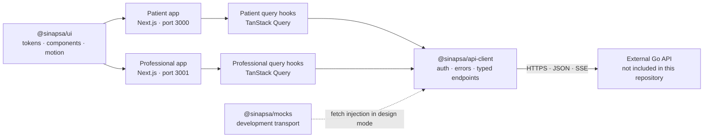

# Sinapsa

Sinapsa is a privacy-conscious mental-health companion interface that helps patients record day-to-day context and lets authorized professionals review structured, traceable summaries between sessions.

This repository contains the complete frontend monorepo: a mobile-first patient experience, a professional workspace, a shared API client, and an editorial design system. The backend and AI inference services are separate systems and are not included here.

## Overview

Important context is often lost between appointments: events are forgotten, patterns are difficult to reconstruct, and the next conversation depends on what a person can recall in the moment. Sinapsa provides a voluntary space for patients to write, complete professional-authored check-ins, and explicitly control what is shared with each professional relationship.

The product has two complementary surfaces:

| Surface | Purpose |
| --- | --- |
| Patient app | Conversational journal, daily check-ins, consent management, professional relationships, and account security. |
| Professional app | Patient overview, invitations, report requests, longitudinal context reading, check-in authoring, and access management. |

The interface deliberately describes reported information without presenting automated output as diagnosis or clinical judgment.

## Key features

### Patient experience

- Streaming conversations with optimistic messages, retry states, and conversation history management.
- Daily check-ins authored by connected professionals, with explicit acceptance and revocation flows.
- Invitation acceptance and per-relationship sharing scopes.
- Patient-controlled delivery of requested context reports and check-in collections.
- Account, password, session, consent, and connected-device management.
- Installable PWA experience with Android/Chrome prompts and iOS home-screen guidance.

### Professional experience

- Professional onboarding and profile management.
- Patient invitations and relationship lifecycle management.
- Context report requests with fixed periods and patient authorization.
- Longitudinal report reading with coverage, timeline, provenance, evidence strength, and stated limitations.
- Check-in template authoring, assignment, collection requests, and normalized aggregate views.
- Passkey-based MFA, recovery codes, and cross-device authorization through QR handoff.

### Shared platform

- A typed API client shared by both applications.
- A reusable editorial design system with semantic tokens, responsive folder navigation, accessible primitives, and coordinated motion.
- A development-only in-memory API transport for reviewing complete flows without the backend.

## Architecture



Both applications use the Next.js App Router. Session and UI providers wrap route groups, while app-specific hooks translate server state into TanStack Query caches and mutations. Shared packages are consumed as TypeScript source through the workspace and transpiled by Next.js.

The mock package replaces only the API client's `fetch` implementation. Pages, authentication gates, query hooks, and components remain unchanged, so the preview mode exercises the same UI paths as the connected application. Production builds alias the mock package to an empty stub and reject `NEXT_PUBLIC_DESIGN_MOCK=true`.

## AI boundary

This frontend consumes AI-assisted results but does not run models, agents, prompts, RAG, embeddings, training, or inference.

The implemented client responsibilities are:

- parse authenticated Server-Sent Events and validate stream event shapes;
- reconcile streamed assistant text with optimistic patient messages;
- represent generation state without branching on provider or model names;
- display report provenance, covered periods, limitations, and evidence strength;
- keep clinical interpretation with the professional through descriptive language and explicit uncertainty.

Provider, model, prompt, graph, and schema versions are accepted as traceability metadata from the API. The server-side implementation that produces them is outside this repository.

## Engineering highlights

### Session security

Access tokens live only in the API client's in-memory closure. They are not written to `localStorage`, `sessionStorage`, or JavaScript-managed cookies. The opaque refresh token is expected in an `HttpOnly` cookie and is sent with `credentials: "include"`. Concurrent authorization failures share one refresh request through a single-flight promise.

The professional surface adds WebAuthn passkeys, mandatory MFA gates, one-time recovery-code handling, and a QR-based flow for authorizing another device.

### Resilient API integration

- Production API origins are validated at build time and must use HTTPS.
- UI behavior is driven by stable API error codes instead of server messages.
- Network and API failures map to safe, user-facing descriptions.
- Message sends use one idempotency key per user action and preserve it across retries.
- SSE frames are parsed incrementally; malformed or incomplete streams fail explicitly.

### Consent-aware data flows

The types and screens distinguish metadata visible to patients from generated reports visible to professionals. A professional creates a request for a fixed period; only the patient's explicit send action can start delivery. Check-in responses follow a separate request-and-authorization flow.

### Design system and accessibility

The shared UI package implements semantic color tokens, curated icon concepts, responsive editorial layouts, and a persistent “Folder Frame” navigation model. Motion is centralized, limited to transform and opacity, and reduced to non-spatial transitions when `prefers-reduced-motion` is enabled. Navigation remains link-based, focus states are visible, touch targets are at least 44 px, and state is never communicated by color alone.

### Testable domain presentation

Pure report analytics and dashboard insight derivation are separated from React views. The test suite covers API URL validation, authentication refresh behavior, endpoint contracts, SSE parsing, error mapping, report analytics, mock workflows, and date formatting.

## Tech stack

| Area | Technologies |
| --- | --- |
| Frontend | Next.js 16, React 19, TypeScript 5.9, Tailwind CSS 4 |
| Server state | TanStack Query 5 |
| Authentication | WebAuthn / `@simplewebauthn/browser`, Google Identity Services, cookie-backed refresh sessions |
| UI and motion | Shared semantic-token design system, GSAP 3, Lucide, React QR Code |
| PWA | Web App Manifest and a network-first service worker for the patient app |
| Testing and quality | Vitest, ESLint 9, strict TypeScript, custom WCAG contrast checks |
| Deployment | OpenNext for Cloudflare, Cloudflare Workers, Wrangler |
| Workspace | pnpm workspaces |

There is no database, migration system, model runtime, or container configuration in this frontend repository.

## Repository structure

```text
apps/
├── patient/          # Mobile-first patient application and PWA
└── professional/     # Professional dashboard and passkey flows
packages/
├── api-client/       # Session lifecycle, typed endpoints, SSE, error policy
├── mocks/            # Development-only in-memory API transport and fixtures
├── ui/               # Components, tokens, responsive shell, motion, formatting
└── config/           # Shared lint configuration
scripts/
└── check-contrast.mjs
```

Two implementation documents remain public because they describe code that is actively enforced:

- [Brand Book / Design System V2](SINAPSA_BRANDBOOK_DESIGN_SYSTEM_V2.md)
- [Motion system](MOTION.md)

## Getting started

### Prerequisites

- Node.js 20.9 or newer
- pnpm 11.22.0

### Explore without the backend

The design mode is the fastest reproducible way to inspect both products. It uses fictional, in-memory data and resets on page reload.

```bash
git clone https://github.com/Vini-create/psycho-app-front.git
cd psycho-app-front
pnpm install
pnpm dev:design
```

Open:

- Patient app: <http://localhost:3000>
- Professional app: <http://localhost:3001>

### Run against the API

```bash
cp apps/patient/.env.example apps/patient/.env.local
cp apps/professional/.env.example apps/professional/.env.local
pnpm dev
```

By default, both applications expect the API at `http://localhost:8080`. The external API must allow `http://localhost:3000` and `http://localhost:3001` as browser origins and provide the endpoint contracts represented in `packages/api-client/src/endpoints/`.

Individual applications can be started with:

```bash
pnpm dev:patient
pnpm dev:professional
```

## Environment variables

All frontend variables are embedded into the browser bundle. They must never contain private keys or server-side secrets.

| Variable | Apps | Required | Description |
| --- | --- | --- | --- |
| `NEXT_PUBLIC_API_URL` | Both | Production | Absolute API origin. Production builds require HTTPS and reject credentials, paths, queries, and localhost. |
| `NEXT_PUBLIC_GOOGLE_CLIENT_ID` | Both | No | Public Google OAuth web client ID used by Google Identity Services. |
| `NEXT_PUBLIC_DESIGN_MOCK` | Both | Development only | Enables the in-memory transport. Production builds reject `true`. |
| `NEXT_PUBLIC_DESIGN_PREVIEW` | Patient | No | Enables the internal `/design-system` review route. |

Safe templates are available in each application:

- `apps/patient/.env.example`
- `apps/patient/.env.production.example`
- `apps/professional/.env.example`
- `apps/professional/.env.production.example`

## Quality checks

Run the complete workspace checks from the repository root:

```bash
pnpm test
pnpm lint
pnpm typecheck
pnpm contrast
```

Production builds require an HTTPS API origin. Configure the production templates or provide a safe origin for local verification:

```bash
NEXT_PUBLIC_API_URL=https://api.example.com pnpm build
```

## Deployment

Each application is configured as an independent Cloudflare Worker through OpenNext:

```bash
pnpm --filter @sinapsa/patient cf:build
pnpm --filter @sinapsa/professional cf:build
```

Worker names, compatibility flags, static asset bindings, and observability are defined in each app's `wrangler.jsonc`. Deployment credentials belong in the platform secret store, never in this repository.

## Current limitations

- The external Go API and AI inference services are required for connected operation and are not included here.
- The mock transport is an interface review tool, not an end-to-end or backend integration environment.
- Plan catalogs are implemented, but checkout and subscription management are not connected in the frontend yet.
- Automated tests focus on the API client, mock workflows, and pure presentation logic; browser-level end-to-end coverage is not present.
- No CI workflow or public live deployment is currently included in this repository.

## Author

Vinicius França — [GitHub](https://github.com/Vini-create)
